## Avalanche | Avalanche: A Network of Networks with

Task : Gain a high-level understanding of Avalanche's Network architecture, Subnet deployment, and potentially a Teleporter bridge deployment.

avalanche subnet deploy mysubnet

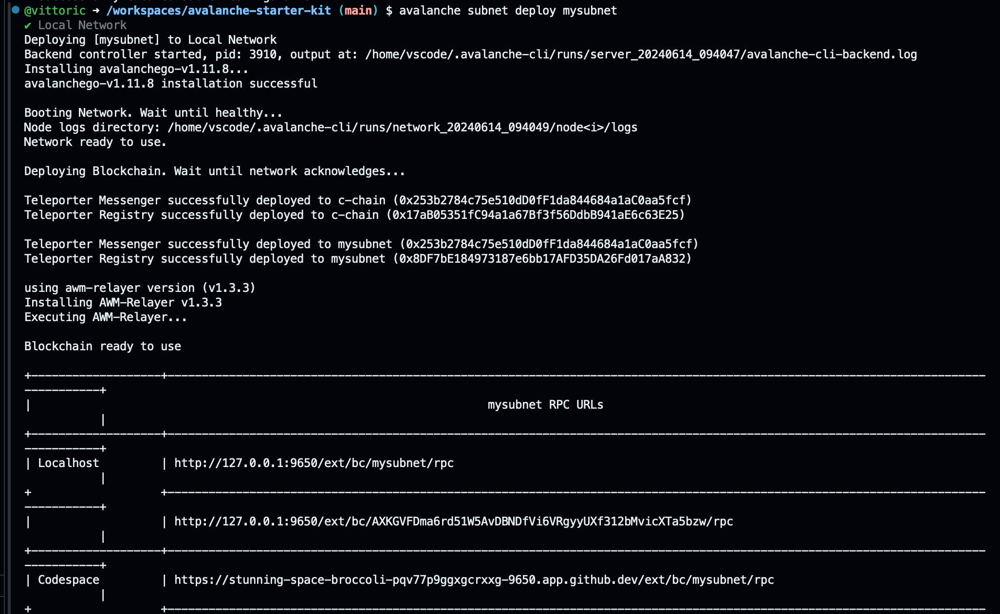

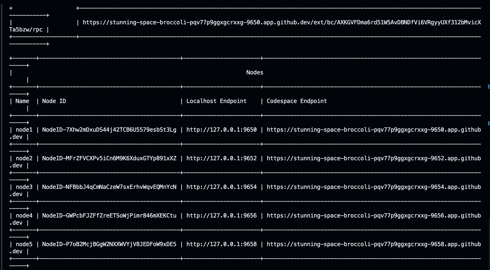

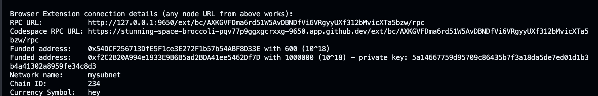

valanche subnet describe mysubnet

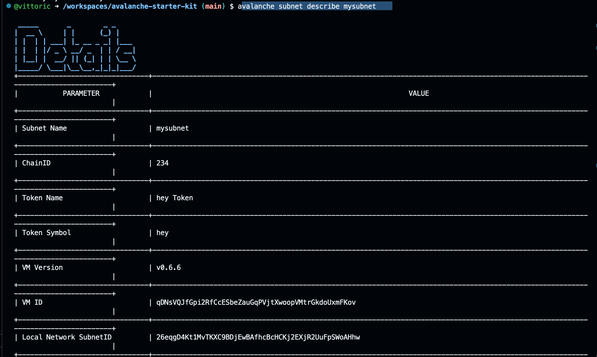

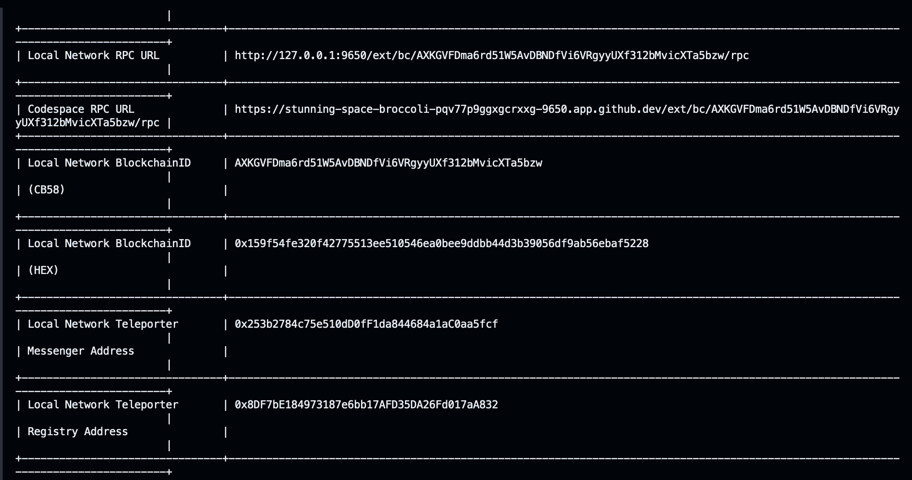

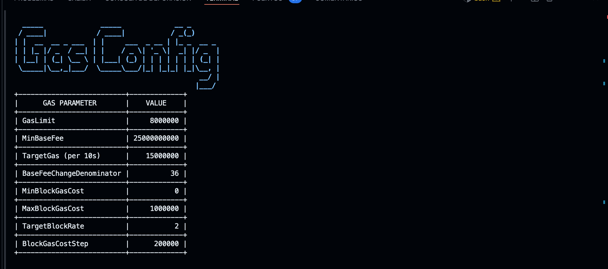

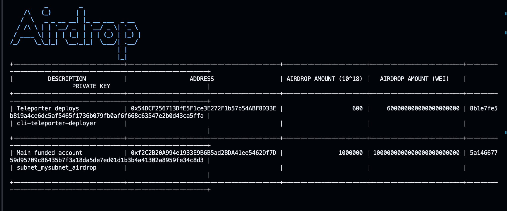

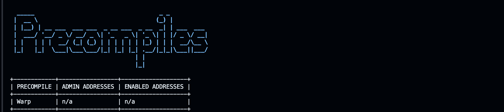

forge create --rpc-url local-c --private-key $PK src/0-send-receive/senderOnCChain.sol:SenderOnCChain

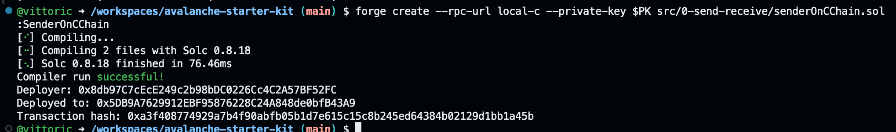

forge create --rpc-url mysubnet --private-key $PK src/0-send-receive/receiverOnSubnet.sol:ReceiverOnSubnet

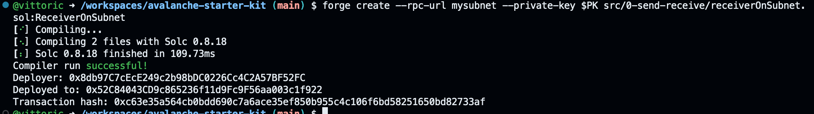

cast send --rpc-url local-c --private-key $PK <sender_contract_address> "sendMessage(address,string)" <receiver_contract_address> "Hello"

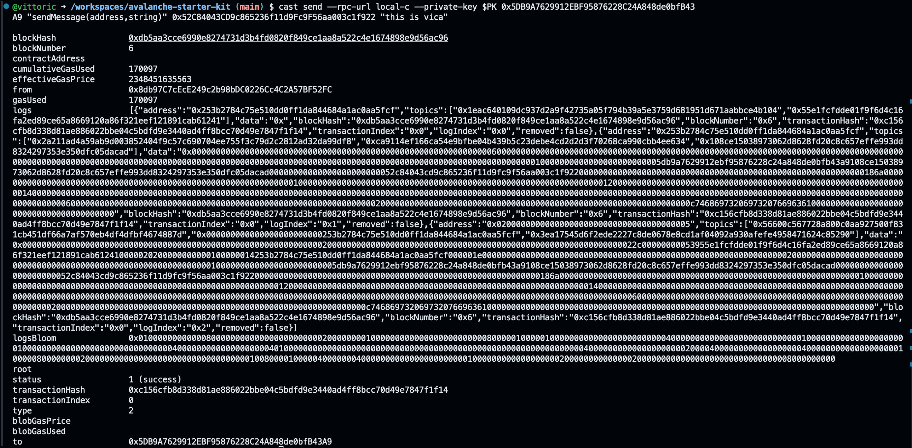