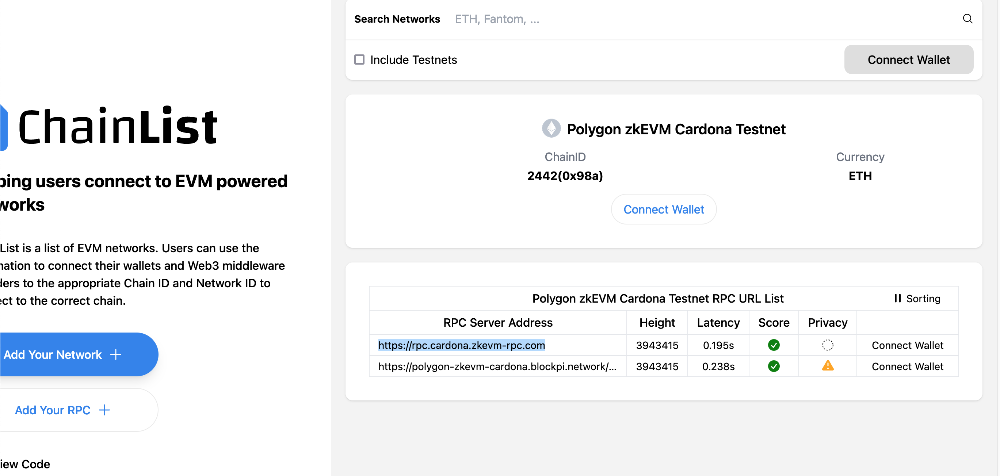

** Polygon | Building Full-Stack Applications on Polygon zkEVM with @finessevanes  
Installl louchpoad npm install -g @polygonlabs/dapp-launchpad
Initialize a new project¶

dapp-launchpad init <PROJECT-NAME>

https://docs.polygon.technology/tools/dApp-development/launchpad/quickstart/#set-up-environment-variables

dapp-launchpad dev

Local Host Test

