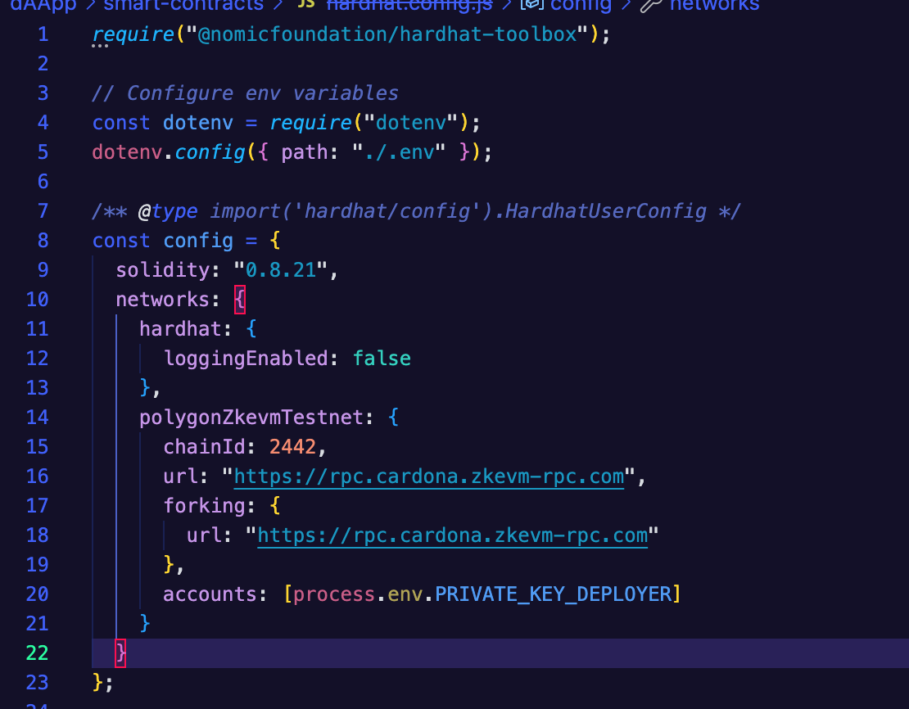

** Polygon | Building Full-Stack Applications on Polygon zkEVM with @finessevanes  
Installl louchpoad npm install -g @polygonlabs/dapp-launchpad
Initialize a new project¶
Plygon docs : https://docs.polygon.technology/tools/dApp-development/launchpad/quickstart/#start-developing-on-an-existing-chain-fork

Hardhat config

dapp-launchpad init <PROJECT-NAME>

https://docs.polygon.technology/tools/dApp-development/launchpad/quickstart/#set-up-environment-variables

dapp-launchpad dev

Local Host Test

mi wallet: 0xF7b701246a8926B01FaDCDF8F1D0eFD40a1Ef9F1

Transaction Hash: 0xa98a1ad4c0d97911bd4eb053ac976f7547541754dcc92f0f1c1607e823161b64

https://cardona-zkevm.polygonscan.com/tx/0xa98a1ad4c0d97911bd4eb053ac976f7547541754dcc92f0f1c1607e823161b64

